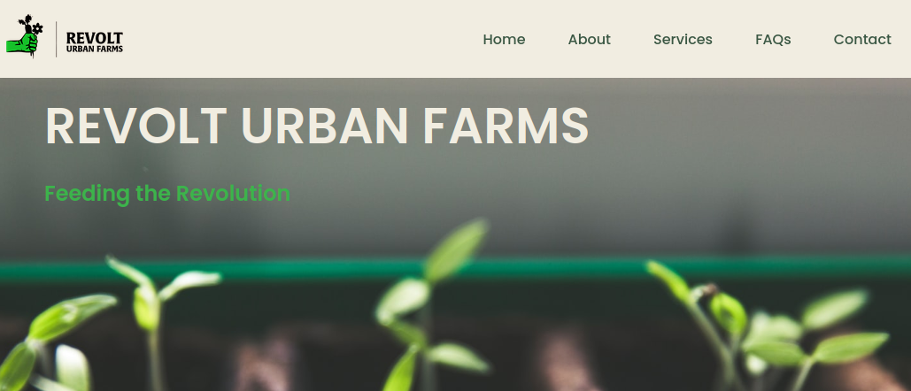

# revolturbanfarms



## [Revolt Urban Farms](https://revolturbanfarms.org)

### HTML / CSS / Javascript

---

- HTML
- CSS
- Javascript
- Remixicons
- EmailJS

## Table of Contents

- [Revolt Urban Farms Website](#revolt-urban-farms)
- [[revolturbanfarms.org](https://revolturbanfarms.org)](#-revolturbanfarmsorg--https---revolturbanfarmsorg-)
- [Features](#features)
- [About](#about)
- [Contributing](#contributing)
- [Color Palette](#color-palette)
- [remixicons](#remixicons)
- [EmailJS](#emailjs)
- [Commit Log](#commit-log)
- [Action Items](#action-items)

## Features

- Non-profit urban farm website using HTML, CSS, and JavaScript.
- Smooth scrolling in each section.
- Mobile First compatible with all mobile devices and with a beautiful and pleasant user interface.
- Contact Form integration w/ Emailjs
- FAQs section with Accodion Menus using vanilla Javascript

## About

Revolt Urban Farms is an immersive and visually captivating website that showcases the organization's commitment to urban agriculture and food justice. Built with HTML, CSS, and JavaScript, this responsive website follows the principles of the Mobile First methodology, ensuring seamless compatibility across all devices. With a dynamic color palette and striking photographs of Baltimore City, the website instantly captures visitors' attention and creates an intriguing visual experience.

The site features a contact form, which is integrated using EmailJS. This allows visitors to easily get in touch with Revolt Urban Farms, fostering communication and collaboration. The website also incorporates Remixicons, adding a touch of creativity and uniqueness to the design. These icons serve as visual elements that enhance the user experience and provide intuitive navigation throughout the site.

## Contributing

As this is a personal website, there is little room for contributions. However, if you find any issues or have suggestions for improvements, please feel free to open an issue.

### Color Palette

  1. --first-color: #3cb34b;
  2. --first-color-alt: #32352d;
  3. --first-color-light: #acac9c;
  4. --first-color-lighten: #c3a995;
  5. --title-color: #3a5743;
  6. --text-color: #1d0e0d;
  7. --text-color-light: #6d6464;
  8. --body-color: #f1ede1;
  9. --container-color: #fff;

### Remixicons

The website utilizes Remixicons for its extensive collection of icons. The icons are incorporated directly into the HTML and CSS files using the Remixicon CDN.

```html
<link href="https://cdn.jsdelivr.net/npm/remixicon@2.5.0/fonts/remixicon.css" rel="stylesheet">
```

For more information on using Remixicons and to explore the available icons, please refer to the [Remixicon website](https://remixicon.com/).

### EmailJS

The website integrates EmailJS to enable contact form submission and communication. The following JavaScript library is included:

```html
<script type="text/javascript" src="https://cdn.jsdelivr.net/npm/@emailjs/browser@3/dist/email.min.js">
</script>
```

This integration allows user messages from the contact form to be sent to the designated email inbox. Further details on setting up and utilizing EmailJS can be found in the EmailJS documentation. More info on setting up EmailJs can be found @ [emailjs.com/docs/](https://www.emailjs.com/docs/)

The website also includes a contact form that utilizes EmailJs to send user messages to the provider's fastmail inbox. The `email.js` file generates a random number before sending the contact form message to the client.

## Commit Log

9/5/23

- FIX(a11y): Resolve heading contrast issues by applying overlays.

9/4/23

- FIX(a11y): Improve site accessibility by adding ARIA labels, alt tags and resolving orphaned labels and contrast issues.

- FIX(main): Replace pageYoffset with scrollY and rectify typo in scroll-behavior smooth.

- FEAT(main): Improve SEO optimization with meta tags.

7/5/23

- BRANCH w3c: Update README.md and Fixed w3c validation issues
   1. Fixed W3C validation issues, including unnecessary type attribute in script tags, height attribute value in image tags, and named character reference.
   2. Resolved filepath issues for logo images and other resources.
   3. Corrected href attribute value for the mailto link in the footer.
   4. Fixed div element being used as a child of ul element issue in the footer.
   5. Made adjustments to the contact form, including label for attribute value.
   6. Inserted a website screenshot in the README file.

4/5/23

- FEAT: Integrate contact form submission with Emailjs to `contact@revolturbanfarms.org`

4/4/23

- Adjust responsive subscribe input and logo under 360px screens

4/3/23

- Adjust responsive grid for HOME section on medium screens

- Adjust responsive styling for FOOTER section && change breakpoint to 1300px for large screens

4/1/23

- Set reusable class for full-width images && adjust responsive styling on HOME/STEPS/FAQS section

3/31/23

- ADJUST: hero__container responsive positioning

- FIX: app.css HERO section background-image url path to navigate out to root dir

3/30/23

- ADD 5 additional HERO sections

- Adjust max-width on container app.css line 143

- Adjust HERO container breakpoints for each

3/29/23

- BRANCH home/hero: C&S Hero section

- Replace footer plate logo on small devices

- Integrate Media queries for small, medium, and large screens

3/28/23

- FEAT: Integrate webkit scrollbar

- FEAT: Integrate scrollUp feature in bottom right corner

- C&S FOOTER section && insert resources links/logos

- C&S CONTACT section && integrate focus feature on contact__input

3/27/23

- Site Live @ revolturbanfarms.org

- C&S FAQS section && integrate javscript accordion toggle

- C&S SERVICES section

- C&S STEPS section

- C&S ABOUT section && integrate javascript change background header onScroll

- C&S HOME section && integrate javascript hide/show feature for nav-/toggle/close/links

3/26/23

- Init Commit

## Action Items

- ScrollReveal

- Revisit SERVICES section to finalize descriptions etc

- ADD: link for "learn more" @line 135

- FIX: header margin-bottom

- FIX: service circle
